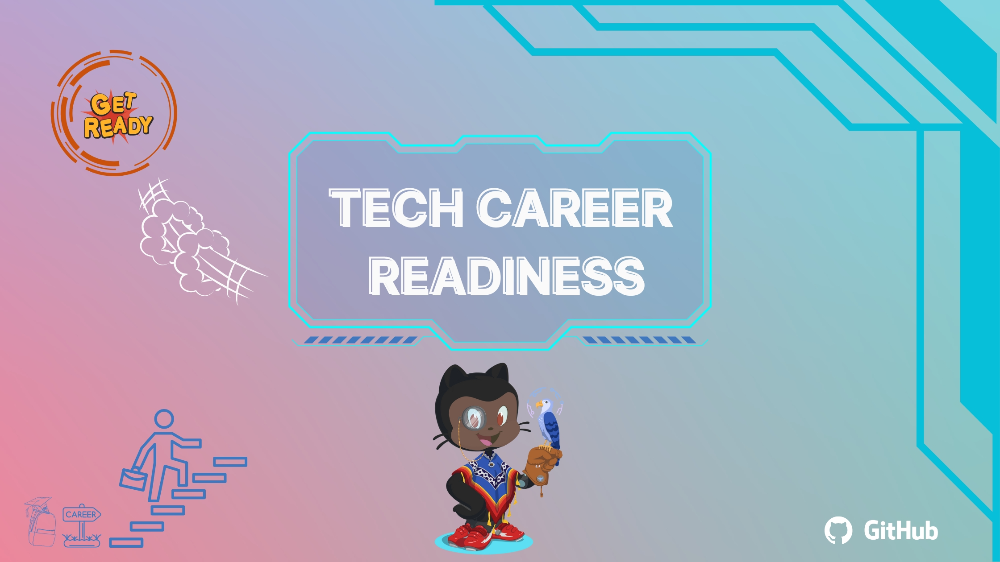

## Event Overview

The GitHub Tech Career Readiness Event is a groundbreaking initiative aimed at empowering students in Tanzania, particularly at the University of Dar es Salaam, with the necessary skills and knowledge to excel in the tech job market. This event brings together students, educators, and leading tech companies to bridge the gap between academia and industry, creating opportunities for underserved communities.

<!--  -->

## Event Date

01/07/2023

## Event Location

University of Dar es Salaam, Tanzania

## Event Objectives

- Provide students with insights into tech career opportunities and the skills required to succeed.
- Foster connections between students and leading tech companies to enhance employment prospects.
- Equip students with essential tech and soft skills for the modern job market.
- Empower underserved communities by creating a more inclusive and diverse tech industry.
- Align with the vision and mission of GitHub Education to promote learning, collaboration, and innovation in the local student tech communities.

## Benefits to our local student tech community

- **Access to Tech Career Opportunities:** Students will have the opportunity to engage directly with tech companies and explore various career paths in the industry. This event will open doors to internships, job placements, and mentorship programs, providing invaluable opportunities for career growth.
- **Enhanced Tech and Soft Skills:** Through panels, and interactive sessions, students will gain practical knowledge and skills in areas such as coding, project management, version control, and communication. These skills are essential for success in the tech job market and will empower students to thrive in their careers.
- **Networking and Collaboration:** The event will facilitate networking opportunities with industry professionals, enabling students to build valuable connections and expand their professional network. Collaboration with like-minded individuals and exposure to diverse perspectives will foster innovation and creativity.
- **Exposure to Industry Trends:** Students will gain insights into emerging technologies, industry trends, and the demands of the tech job market. Understanding these trends will enable students to align their skill sets with the evolving needs of the industry, making them more competitive in the job market.

## Event Registration

``` coming soon ! ```